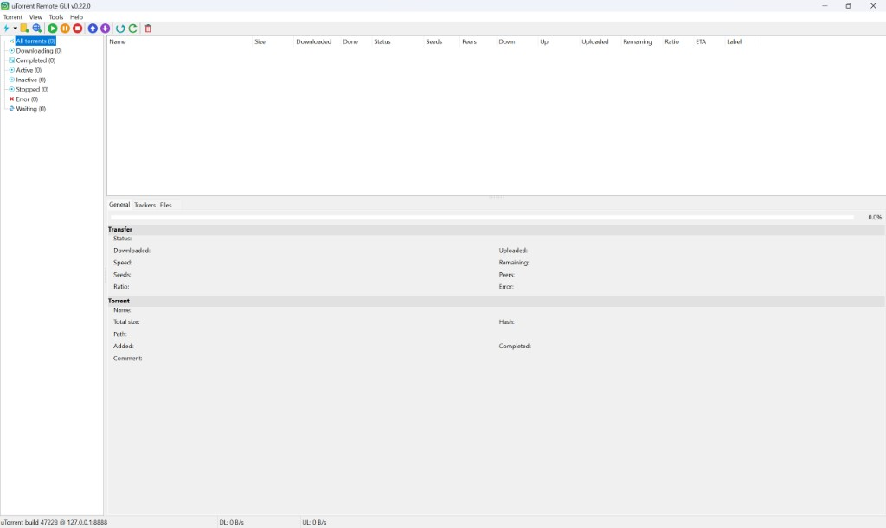

# uTorrent Remote GUI

[](LICENSE)
[](#)
[](#)

Desktop **remote GUI** for **uTorrent / BitTorrent WebUI**, written in **Free Pascal / Lazarus**.  
Inspired by [Transmission Remote GUI (transgui)](https://github.com/transmission-remote-gui/transgui).

**Current version: `0.24.0`**

Also available in Russian: [README.ru.md](README.ru.md)

**Change history:** [CHANGELOG.md](CHANGELOG.md)  
**Publishing releases:** [docs/PUBLISHING.md](docs/PUBLISHING.md)

---

## Features

### Connection
- Multiple **profiles** (host, port, user, password, HTTPS), autoconnect on startup
- **TransGUI-style profile button** on toolbar: dropdown list, active checkmark, new/manage connections, click to reconnect
- WebUI auth: HTTP Basic + CSRF token + **GUID cookie**

### Torrents
- Live list: progress, speeds, ETA, seeds/peers, ratio, label
- Sidebar filters: all / downloading / completed / active / inactive / stopped / error / queued
- Start, force start, pause, stop, recheck, remove (+ optional delete data)
- Queue up / down / top / bottom
- Add `.torrent` or magnet / URL
- Details: general, files (priorities), trackers
- Open content / folder, copy magnet, configurable columns
- Rich context menu

### Settings
- **Tools → Application settings…** — refresh intervals, tray, proxy, remote/local path map
- **Tools → uTorrent settings…** — remote WebUI preferences by category (tree + scrollable panel), human-readable labels (`lang/utsettings_*.lng`)
- **Tools → Connections…** — profile manager
- Resizable settings windows; **Esc** to close with optional save prompt

### UI
- **View** menu: select all, columns, filter/details/toolbar/status bar toggles, large/small toolbar
- **Menu icons** on main menu and context menus
- System tray, download-finished balloon
- **18 languages** via `lang\*.lng`

Languages included: English, Russian, Ukrainian, Belarusian, Kazakh, Tatar, Esperanto, German, French, Spanish, Italian, Portuguese, Polish, Chinese, Japanese, Turkish, Dutch, Czech.

---

## Screenshots



---

## Requirements

### To run
- Windows 7+ (x64)
- uTorrent or BitTorrent with **WebUI enabled**

### To build
- [Lazarus](https://www.lazarus-ide.org/) + Free Pascal 3.2+
- FCL only (`fphttpclient`, `fpjson`) + LCL — no extra packages

### Enable WebUI in uTorrent
1. **Options → Preferences → Advanced → Web UI**
2. Enable Web UI, set username/password and port (often `8080`)
3. In the remote GUI: **Tools → Connections…** or the toolbar profile button

---

## Quick start (binary)

1. Use the **`dist\`** folder (or a release archive)
2. Run `dist\utorrentgui.exe`
3. Keep **`lang\`** and **`images\`** next to the executable
4. Connect via the toolbar profile button or **Tools → Connections…**

Settings are stored in **`utorrentgui.ini`** beside the exe (password in plain text — protect that file).

---

## Build from source

```bat
build.cmd
```

Or open `utorrentgui.lpi` in Lazarus and build.

`build.cmd`:
1. Compiles with `lazbuild` (release, `-O3`, smart linking)
2. Strips debug symbols
3. Embeds Win32 manifest + icon (`embed-manifest.ps1`) — *after* strip so Explorer keeps the icon
4. Copies **`utorrentgui.exe`**, **`lang\`**, **`images\`** into **`dist\`**

Typical release size: ~**3.6 MB**.

### Release package (ZIP, 7z, installer)

```bat
build-release.cmd
```

Creates **`release\`**:
- `utorrentgui-<version>-win64.zip` — portable folder
- `utorrentgui-<version>-win64.7z` — same, 7-Zip
- `utorrentgui-<version>-setup.exe` — Windows installer (Inno Setup)

Requires [Inno Setup 6](https://jrsoftware.org/isinfo.php) and 7-Zip on the build machine.

> Paths containing `#` break Lazarus resource embedding; the post-link script is required.

---

## Repository layout

```
├── README.md              Main documentation (English)
├── README.ru.md           Russian documentation
├── CHANGELOG.md           Version history
├── VERSION                Version string
├── LICENSE                MIT
├── utorrentgui.lpi/.lpr   Lazarus project
├── build.cmd              Build + package → dist\
├── build-release.cmd      dist + ZIP + 7z + Inno Setup installer → release\
├── utorrentgui.iss        Inno Setup script
├── docs/screenshots/      README screenshots (en.png, ru.png)
├── embed-manifest.ps1     Post-link icon/manifest embed
├── src\                   Pascal sources (see src/README.md)
├── lang\                  UI + uTorrent setting labels (*.lng)
├── images\                Toolbar / app icons
└── dist\                  Ready-to-run build
    ├── utorrentgui.exe
    ├── lang\
    ├── images\
    └── README.txt
```

---

## WebUI API (summary)

| Call | Purpose |
|------|---------|
| `GET /gui/token.html` | CSRF token + GUID cookie |
| `GET …&list=1` | Torrent list |
| `GET …&action=getprops&hash=…` | Properties |
| `GET …&action=getfiles&hash=…` | Files |
| `GET …&action=start\|pause\|stop\|…` | Torrent actions |
| `GET …&action=getsettings` / `setsetting` | Remote preferences |
| `GET …&action=add-url&s=…` | Add magnet/URL |
| `POST …&action=add-file` | Upload `.torrent` |

---

## Versioning

Until `1.0.0`: **`0.<build>.0`**.  
Update [`src/appversion.pas`](src/appversion.pas), [`VERSION`](VERSION), and [`utorrentgui.lpi`](utorrentgui.lpi) title together; record changes in [`CHANGELOG.md`](CHANGELOG.md).

---

## Contributing

Issues and PRs welcome: bug reports (OS, uTorrent build, WebUI port), new `lang\xx.lng` files, UI improvements in the TransGUI spirit.

---

## License

MIT — see [LICENSE](LICENSE).

---

## Credits

- Inspired by [Transmission Remote GUI](https://github.com/transmission-remote-gui/transgui)
- Built with [Lazarus / Free Pascal](https://www.lazarus-ide.org/)
