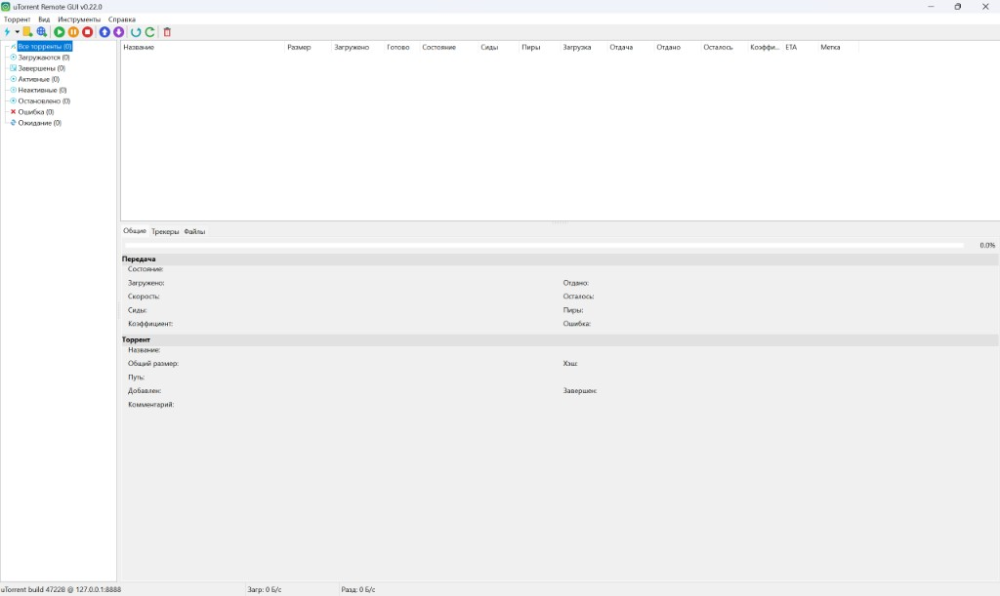

# uTorrent Remote GUI

[](LICENSE)

Настольный **удалённый клиент** для **WebUI uTorrent / BitTorrent** на **Free Pascal / Lazarus**.  
Вдохновлён [Transmission Remote GUI](https://github.com/transmission-remote-gui/transgui).

**Текущая версия: `0.22.0`**

Основная документация (English): [README.md](README.md)  
**История изменений:** [CHANGELOG.md](CHANGELOG.md)

---

## Возможности

### Подключение
- Несколько **профилей** (хост, порт, логин, пароль, HTTPS), автоподключение
- **Кнопка профиля как в TransGUI**: выпадающий список, галочка у активного, «Новое подключение…», «Подключения…», клик — переподключение
- Авторизация WebUI: Basic + CSRF-токен + cookie **GUID**

### Торренты
- Список в реальном времени, фильтры на боковой панели
- Старт, принудительный старт, пауза, стоп, перепроверка, удаление (+ данные)
- Очередь, добавление файла / magnet / URL
- Вкладки информации, файлы, трекеры; magnet, колонки, контекстное меню

### Настройки
- **Инструменты → Настройки приложения…** — интервал обновления, трей, прокси, сопоставление путей
- **Инструменты → Настройки uTorrent…** — параметры на стороне клиента uTorrent по категориям, понятные подписи (`lang/utsettings_*.lng`)
- **Инструменты → Подключения…**
- Окна с изменяемым размером; **Esc** — закрыть с запросом сохранения

### Интерфейс
- Меню **Вид**: выделить всё, колонки, панели, тулбар, строка состояния, крупный/мелкий тулбар
- **Иконки в пунктах меню**
- Трей, уведомление о завершении загрузки
- **18 языков** — файлы `lang\*.lng`

---

## Скриншоты



---

## Быстрый старт

1. Папка **`dist\`** — запуск **`utorrentgui.exe`**
2. Рядом должны быть **`lang\`** и **`images\`**
3. Подключение: кнопка профиля на панели или **Инструменты → Подключения…**

Настройки — в **`utorrentgui.ini`** рядом с exe (пароль хранится открытым текстом).

---

## Сборка

```bat
build.cmd
```

Результат: **`dist\`** или полный релиз:

```bat
build-release.cmd
```

→ **`release\`**: ZIP, 7z, установщик `.exe`.  
Инструкция по GitHub: [docs/PUBLISHING.md](docs/PUBLISHING.md)

---

## Структура проекта

```
README.md          — основная документация (English)
README.ru.md       — этот файл
CHANGELOG.md       — список изменений по версиям
src\               — исходники (src/README.md)
lang\              — переводы интерфейса и подписи настроек uTorrent
dist\              — готовый билд
```

---

## Лицензия

MIT — см. [LICENSE](LICENSE).
